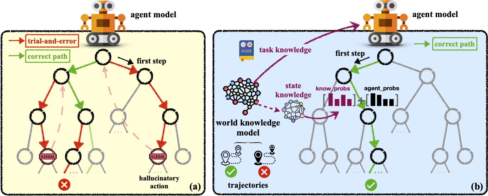

<h1 align="center"> WKM </h1>
<h3 align="center"> Agent Planning with World Knowledge Model </h3>

<p align="center">
  <a href="https://arxiv.org/abs/2405.14205">📄arXiv</a> •
  <a href="https://www.zjukg.org/project/WKM/">🌐Web</a> •
    <a href="https://x.com/omarsar0/status/1793851075411296761">𝕏 Blog</a>
    •
    <a href="https://huggingface.co/collections/zjunlp/wkm-6684c611102213b6d8104f84">🤗 HF</a> •
    <a href="https://notebooklm.google.com/notebook/a3f13ad1-1bc9-4ab2-ace6-9ae4276bc970/audio">🎧NotebookLM Audio</a>


  
</p>

[](https://github.com/zjunlp/WKM) 
[](https://opensource.org/licenses/MIT)
 

## Table of Contents

- 🌻[Acknowledgement](#acknowledgement)
- 🌟[Overview](#overview)
- 🔧[Installation](#installation)
- 📚[World Knowledge Build](#world-knowledge-build)
- 📉[Model Training](#model-training)
- 🧐[Evaluation](#evaluation)
- 🚩[Citation](#citation)

---


## 🌻Acknowledgement

Our code of the training module is referenced and adapted from [LLaMA-Factory](https://github.com/hiyouga/LLaMA-Factory), while the code of the inference module is implemented based on [ETO](https://github.com/Yifan-Song793/ETO). Various baseline codes are sourced from [ReAct](https://github.com/ysymyth/ReAct), [Reflexion](https://github.com/noahshinn/reflexion), [NAT](https://github.com/reason-wang/nat), [ETO](https://github.com/Yifan-Song793/ETO). We use LangChain with open models via [Fastchat](https://github.com/lm-sys/FastChat/blob/main/docs/langchain_integration.md). Thanks for their great contributions!




## 🌟Overview

Recent endeavors towards directly using large language models (LLMs) as agent models to execute interactive planning tasks have shown commendable results. Despite their achievements, however, they still struggle with brainless trial-and-error in global planning and generating hallucinatory actions in local planning due to their poor understanding of the "real" physical world. Imitating humans' world knowledge model which provides global prior knowledge before the task and maintains local dynamic knowledge during the task, in this paper, we introduce parametric World Knowledge Model (***WKM***) to facilitate agent planning. Concretely, we steer the agent model to self-synthesize knowledge from both expert and sampled trajectories. Then we develop ***WKM***, providing prior task knowledge to guide the global planning and dynamic state knowledge to assist the local planning. Experimental results on three complex real-world simulated datasets with three state-of-the-art open-source LLMs, Mistral-7B, Gemma-7B, and Llama-3-8B, demonstrate that our method can achieve superior performance compared to various strong baselines. Besides, we analyze to illustrate that WKM can effectively alleviate the blind trial-and-error and hallucinatory action issues, providing strong support for the agent's understanding of the world. 
Other interesting findings include: 
1) our instance-level task knowledge can generalize better to unseen tasks, 
2) weak WKM can guide strong agent model planning
3) unified WKM training has promising potential for further development


## 🔧Installation

```bash
git clone https://github.com/zjunlp/WKM
cd WKM
pip install -r requirements.txt
```

## 📚World Knowledge Build

To build the task knowledge
```sh
python world_knowledge_build.py \
    --dataset_path your/rejected and chosen/data/pair \
    --task your/task \
    --gen task_knowledge \
    --model_name your/model/name \
    --output_path your/output/path
```

To build the state knowledge
```sh
python world_knowledge_build.py \
    --dataset_path your/rejected and chosen/data/pair \
    --task your/task \
    --gen state_knowledge \
    --model_name your/model/name \
    --output_path your/output/path
```

After your get task_knowledge and state_knowledge, process the data to train format
```
python train_data_process.py \
    --task alfworld \
    --file_path your/path \
    --mode model_type
    --output_path your/output/path
```

And use the state knowledege train data to build state knowledge cache base
```
python state_base_build.py \
    --state_file_path your/state/knowledge/path \
    --state_action_pair_path path/to/store/state_action/pair \
    --vector_cache_path path/to/store/vector/cache
```
Our training data has been uploaded to [huggingface](https://huggingface.co/datasets/zjunlp/WKM-train-data).

## 📉Model Training

Use LLama-Factory to train the agent model and world model 
```sh
CUDA_VISIBLE_DEVICES=0,1,2,3 accelerate launch \
    --config_file ./examples/accelerate/single_config.yaml \
    src/train_bash.py \
    --ddp_timeout 180000000 \
    --stage sft \
    --do_train \
    --model_name_or_path /base/model/path \
    --dataset_dir ./data \
    --dataset train_data_for_agent \
    --template model_template \
    --finetuning_type lora \
    --lora_target q_proj,v_proj \
    --output_dir ../lora/peft_model_name \
    --overwrite_cache \
    --per_device_train_batch_size 4\
    --gradient_accumulation_steps 2 \
    --lr_scheduler_type cosine \
    --logging_steps 1 \
    --save_steps 1000 \
    --learning_rate 1e-4 \
    --num_train_epochs 3 \
    --plot_loss \
    --fp16 \
    --cutoff_len 2048 \
    --save_safetensors False \
    --overwrite_output_dir \
    --train_on_prompt False
```

## 🧐Evaluation


To evaluate the task, you should first lanuch a local API server with fastchat. Our lora model adapter weights can be downloaded from [here](https://huggingface.co/collections/zjunlp/wkm-6684c611102213b6d8104f84).
```sh
cd .src/eval
# agent_model api server
python -u -m fastchat.serve.model_worker \
    --model-path /path/peft/agent_model \
    --port 21020 \ 
    --worker-address http://localhost:21020 \
    --max-gpu-memory 31GiB \
    --dtype float16
# world_knowledge_model api server
python -u -m fastchat.serve.model_worker \
    --model-path /path/peft/world_model \
    --port 21021 \ 
    --worker-address http://localhost:21021 \
    --max-gpu-memory 31GiB \
    --dtype float16
```

Evaluate the task
```sh
python -m eval_agent.eto_multi_main_probs \
    --agent_config fastchat \
    --agent_model_name agent_model \
    --world_model_name world_model \
    --exp_config alfworld \
    --exp_name eval \
    --split test
```

## 🚩Citation

Please cite our repository if you use WKM in your work. Thanks!

```bibtex
@article{DBLP:journals/corr/abs-2405-14205,
  author       = {Shuofei Qiao and
                  Runnan Fang and
                  Ningyu Zhang and
                  Yuqi Zhu and
                  Xiang Chen and
                  Shumin Deng and
                  Yong Jiang and
                  Pengjun Xie and
                  Fei Huang and
                  Huajun Chen},
  title        = {Agent Planning with World Knowledge Model},
  journal      = {CoRR},
  volume       = {abs/2405.14205},
  year         = {2024},
  url          = {https://doi.org/10.48550/arXiv.2405.14205},
  doi          = {10.48550/ARXIV.2405.14205},
  eprinttype    = {arXiv},
  eprint       = {2405.14205},
  timestamp    = {Wed, 19 Jun 2024 08:52:49 +0200},
  biburl       = {https://dblp.org/rec/journals/corr/abs-2405-14205.bib},
  bibsource    = {dblp computer science bibliography, https://dblp.org}
}
```


## 🎉Contributors

<a href="https://github.com/zjunlp/WKM/graphs/contributors">
  </a>

We will offer long-term maintenance to fix bugs and solve issues. So if you have any problems, please put issues to us.
